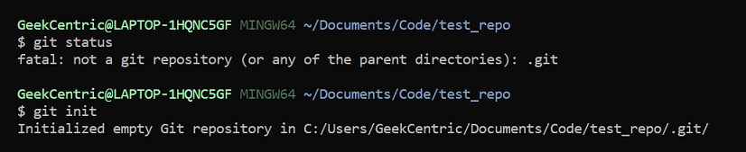
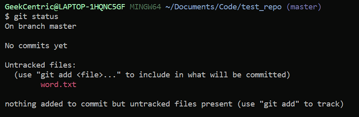
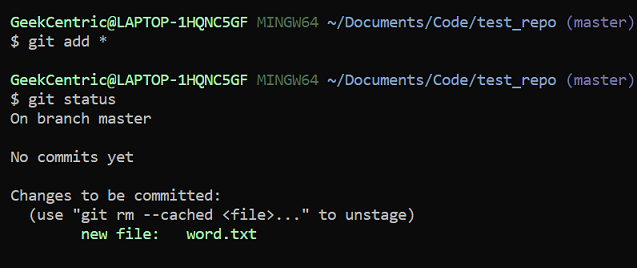
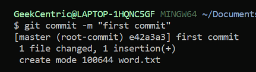
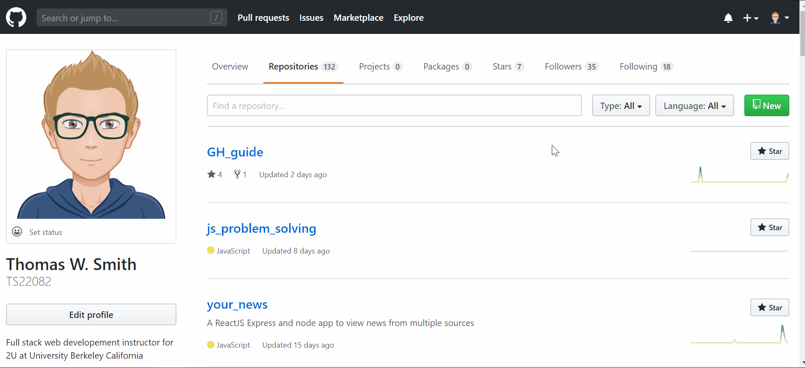
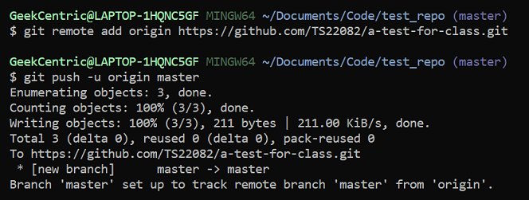
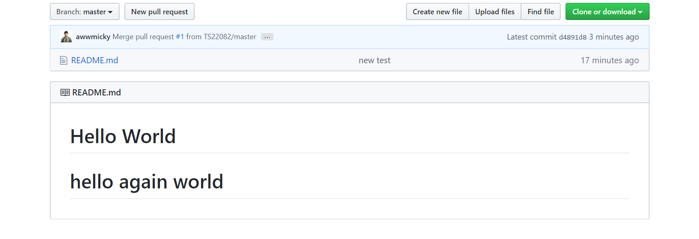

# Jump to sections
- [First Commit](#first)<br>
- [Branching](#branching)<br>
- [Versioning](#versioning)<br>
- [Forking with pull requests](#forkandpull)

<h1 id="first">First Commit</h1>

At the very beginning of your project you should set it up on github and update (commit) frequently. 

Check to make sure the folder isnt already set up as a repo by running  ```git status```. If you get back a message saying the folder isnt a repo run ```git init```



Create a new file. For this example, I created a word.txt file.

Run ```git status``` from the root folder to see if there is an untracked file in the repo. Since its new we can assume there is.



To track all the files in the repo run ```git add *```



Commit your changes with ``` git commit -m <any message in quotes>```



From here you need to add a remote origin. To get the remote origin link you will need to create a project on github. Leave the checkbox "create with README.md" unchecked. Copy the line that contains ```git remote add origin <repo-link>```



Paste the line you just copied into the terminal then push to the origin master with ```git push -u origin master```




After it has finished refresh your github repo page and it will be updated with the new code.


# Branching

**Example:**


The first thing to do is to create a new branch and then move to that branch

**In your terminal**

```
git checkout -b <branchname>
```

**Example:**


&nbsp;

# Add changes

Add you changes to the code then go through the push process

```
git add *
git commit -m "added changes"
git push origin <branchname>
```

**In your browser**

Navigate to the code repo on your github

Click Branches (next to code)

Find your branch then click "create pull request"

Click "Accept changes" (This will update the changes you made to the repos master)


## Pull changes

**In your terminal**

Change to the master branch

```
git checkout master
```

Then pull changes

```
git pull
```

## Clean Tree

List branches

```
git branch -l
```

Delete the old branch (this keeps the tree clean)

```
git branch -d <branchname>
```

**Example:**


At this point you are on master, the code has been update, and you are ready to create a new branch to start working on a new feature.

# Versioning

There are many ways to go back to an old version using git and github. I prefer to copy the version I want to a seperate branch and make a pull request because it will preserve your prior commits.


```
git checkout -b <branch name> <commit hash>
```

This will create a new branch with the old version of the code. 

Add a comment or make some minor change so you can add.

```
git commit -m "go back to old version of code"
git add *
git push origin <branch name>
```

Navigate repo, you will see a new pull request. Accept the change and merge to master.

<h1 id="forkandpull">Forking and Making Pull Requests</h1>

Anytime you want to add to someone elses code on gh you will fork the original code so you have a copy you can make changes to, then make a pull request to let the original creator you made a contribution they can accept or decline.

A friends repo that I will fork:


After I fork the repository I will have a copy on my github account that I can clone and update.


Navigate back to the repo on github (your account). You will see your version has been updated. If this is a change we want the original creator to include in ther code, make a pull request.


The original code owner will be notified there is a new pull request. After they accept it the code will e updated. 




