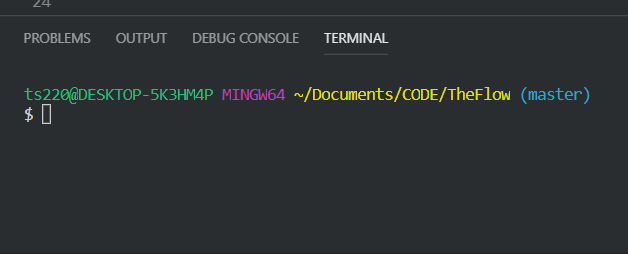

# You're on master

Example:


The first thing to do is to create a new branch and then move to that branch

**In your terminal**

```
git checkout -b <branchname>
```

Example:

&nbsp;&nbsp;

# Add changes

Add you changes to the code then go through the push process

```
git add *
git commit -m "added changes"
git push origin <branchname>
```

**In your browser**

Navigate to the code repo on your github

Click Branches (next to code)

Find your branch then click "create pull request"

Click "Accept changes" (This will update the changes you made to the repos master)

**In your terminal**

Change to the master branch

```
git checkout master
```

Then pull changes

```
git pull
```

List branches

```
git branch -l
```

Delete the old branch (this keeps the tree clean)

```
git branch -d <branchname>
```

At this point you are on master, the code has been update, and you are ready to create a new branch to start working on a new feature.
